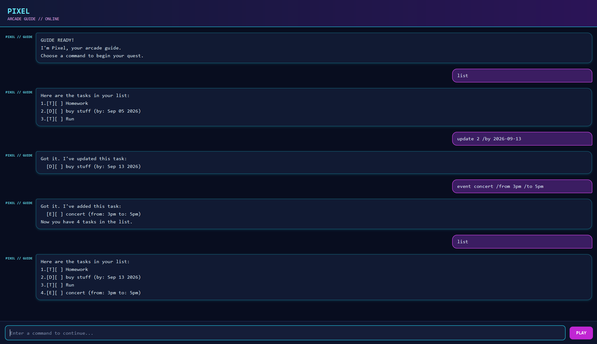

# Pixel User Guide

Pixel is an arcade-themed task manager that helps you keep track of todos, deadlines, and events using simple commands.



## Quick start

### Run from the project

1. Install Java 25.
2. Download or clone the project.
3. Open a terminal in the project folder.
4. Run the appropriate command:

   **Windows:**

   ```shell
   gradlew.bat run
   ```

   **macOS or Linux:**

   ```shell
   ./gradlew run
   ```

### Run as a JAR file

Build the executable JAR with:

```shell
gradlew.bat shadowJar
```

On macOS or Linux, use `./gradlew shadowJar` instead. The generated file is located at `build/libs/pixel.jar`.

Run it with:

```shell
java -jar build/libs/pixel.jar
```

> **Note:** Commands are case-sensitive and should be entered in lowercase. Text written in uppercase below, such as `DESCRIPTION` and `INDEX`, represents a value that you should replace.

## Using Pixel

Enter a command in the text field, then press **Enter** or select **PLAY**. Pixel will display the result in the conversation area.

### View all tasks: `list`

Shows every task and its current status.

```text
list
```

`[X]` means the task is done, while `[ ]` means it is not done. `[T]`, `[D]`, and `[E]` identify todos, deadlines, and events respectively.

### Add a todo: `todo`

Adds a task that has no date or time.

```text
todo borrow book
```

Format: `todo DESCRIPTION`

### Add a deadline: `deadline`

Adds a task that must be completed by a specific date. Enter the date as `yyyy-MM-dd`; Pixel displays it as `MMM dd yyyy`.

```text
deadline submit report /by 2026-09-30
```

Format: `deadline DESCRIPTION /by DATE`

### Add an event: `event`

Adds a task with a start and an end. Event times may be written as meaningful text, provided both values are present.

```text
event project meeting /from Mon 2pm /to 4pm
```

Format: `event DESCRIPTION /from START /to END`

If both values can be interpreted as dates or times, the start must be earlier than the end.

### Mark a task as done: `mark`

Marks the task at the given list number as done.

```text
mark 2
```

Format: `mark INDEX`

### Mark a task as not done: `unmark`

Reverses the done status of the task at the given list number.

```text
unmark 2
```

Format: `unmark INDEX`

### Delete a task: `delete`

Removes the task at the given list number.

```text
delete 3
```

Format: `delete INDEX`

### Find tasks: `find`

Shows tasks whose descriptions contain the keyword. Keyword matching is case-sensitive.

```text
find book
```

Format: `find KEYWORD`

### View tasks on a date: `date`

Shows deadlines and events that occur on the specified date.

```text
date 2026-09-30
```

Format: `date DATE`

The date must use the `yyyy-MM-dd` format.

### Update a task: `update`

Changes one detail of an existing task without deleting and recreating it.

Change a description:

```text
update 2 /description buy groceries
```

Change a deadline date:

```text
update 2 /by 2026-10-01
```

Change an event start or end:

```text
update 3 /from Tue 3pm
update 3 /to Tue 5pm
```

Format: `update INDEX /description DESCRIPTION`, `update INDEX /by DATE`, `update INDEX /from START`, or `update INDEX /to END`

Only options that apply to the selected task type can be used. For example, `/by` applies only to deadlines.

### Exit Pixel: `bye`

Displays Pixel's goodbye message and ends the session.

```text
bye
```

## Saving tasks

Pixel automatically saves the task list to `data/pixel.txt` whenever the list changes. Saved tasks are loaded automatically the next time Pixel starts. If the file does not exist yet, Pixel starts with an empty task list and creates the file when needed.

> **Warning:** Do not edit `data/pixel.txt` while Pixel is running. Invalid or damaged entries may be skipped when the file is loaded.

## Command summary

| Action | Command |
| --- | --- |
| View all tasks | `list` |
| Add a todo | `todo DESCRIPTION` |
| Add a deadline | `deadline DESCRIPTION /by DATE` |
| Add an event | `event DESCRIPTION /from START /to END` |
| Mark a task done | `mark INDEX` |
| Mark a task not done | `unmark INDEX` |
| Delete a task | `delete INDEX` |
| Find tasks | `find KEYWORD` |
| View tasks on a date | `date DATE` |
| Update a task | `update INDEX OPTION VALUE` |
| Exit Pixel | `bye` |

## Troubleshooting

- Check the command spelling if Pixel does not recognize it.
- Ensure required descriptions, dates, times, and task numbers are present.
- Use a task number shown by `list`.
- Use a real date in `yyyy-MM-dd` format for deadlines and the `date` command.
- Avoid adding an exact duplicate of an existing task.
